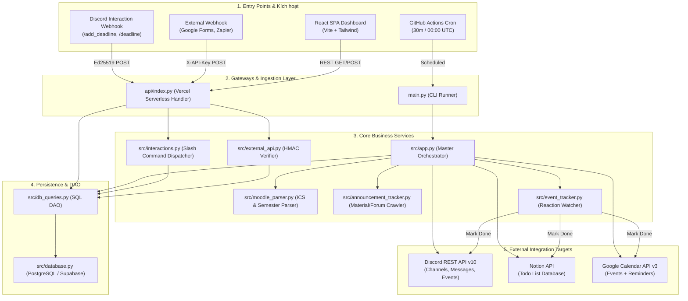

# PHẦN 3: LUỒNG DỮ LIỆU TỔNG THỂ (END-TO-END DATA FLOW)

> **File:** `03_END_TO_END_DATA_FLOW.md`  
> **Ngữ cảnh sử dụng:** Mô tả chi tiết cách dữ liệu di chuyển từ các điểm bắt đầu (Entry points), qua tầng xử lý nghiệp vụ, đến cơ sở dữ liệu và các hệ sinh thái bên ngoài.

---

## 1. Sơ đồ kiến trúc luồng dữ liệu (Data Architecture)

---

## 2. Chi tiết 4 luồng dữ liệu nghiệp vụ chính

### Luồng 1: Chu trình Cron tự động quét và thông báo (`main.py` -> `src/app.py`)
1. **Trigger:** GitHub Actions kích hoạt `python main.py` mỗi 30 phút.
2. **Đối soát phản hồi (Reaction Check):**
   * `src/event_tracker.py` gọi Discord API quét reactions `✅` trên các tin nhắn deadline đang mở.
   * Nếu có người dùng bấm hoàn thành: Cập nhật `completed = true` trong DB, đổi trạng thái Discord Event sang `COMPLETED`, đánh dấu Done trên Notion và đổi màu xanh lá kèm tiền tố `✅ [XONG]` trên Google Calendar.
3. **Thu thập dữ liệu Moodle:**
   * Tải nội dung iCalendar từ `MOODLE_CALENDAR_URL` -> `src/moodle_parser.py` bóc tách từng sự kiện (UID, Tên bài, Hạn chót, Mã môn, Học kỳ).
   * Lấy các deadline được thêm thủ công gần đây từ database (`get_pending_manual_deadlines`).
4. **Phân loại & Kiểm tra trạng thái thông báo:**
   * So sánh với bảng `deadlines`:
     * **Sự kiện mới:** Gửi tin nhắn thông báo vào kênh môn học tương ứng (tạo kênh mới nếu chưa có, đưa vào Category học kỳ), thêm reaction `✅`, tạo Discord Scheduled Event, đồng bộ sang Notion và Google Calendar.
     * **Cách 3 ngày & chưa nhắc:** Gửi thông báo nhắc nhở 3 ngày (`reminded_3d = true`).
     * **Cách 1 ngày & chưa nhắc:** Gửi thông báo khẩn cấp 1 ngày (`reminded_1d = true`).

### Luồng 2: Xử lý lệnh tương tác Discord (Slash Commands)
1. **Trigger:** Người dùng gõ lệnh `/add_deadline` hoặc `/deadline` trên Discord.
2. **Gateway:** Discord gửi webhook POST tới `https://domain.vercel.app/api/interactions`.
3. **Xác thực mật mã:** `src/interactions.py` sử dụng thư viện `pynacl` xác thực chữ ký Ed25519 bằng `DISCORD_PUBLIC_KEY`.
4. **Xử lý lệnh:**
   * Với `/add_deadline`: Bóc tách tên môn, tên bài và hạn chót (hỗ trợ tự nhận diện mã môn nếu đang chat trong kênh môn đó). Ghi dữ liệu vào database với `source = 'manual'`, trả về phản hồi công khai xác nhận. Bot sẽ gửi thông báo đầy đủ trong lượt cron kế tiếp.
   * Với `/deadline`: Truy vấn các deadline sắp tới gần nhất và trả về tin nhắn ephemeral (chỉ người dùng thấy).

### Luồng 3: Webhook bên thứ 3 (`api/add_deadline.py`)
1. **Trigger:** Google Forms (Apps Script) hoặc Zapier gửi POST request JSON chứa thông tin bài tập.
2. **Bảo mật:** `src/external_api.py` kiểm tra header `X-API-Key` với `EXTERNAL_API_KEY` qua thuật toán `hmac.compare_digest`.
3. **Lưu trữ:** Lưu vào PostgreSQL với mã định danh `lms_deadlines_id = external-{uuid}`, cờ `source = 'external'`, chống ghi đè/trùng lặp bằng câu lệnh `ON CONFLICT DO NOTHING`.

### Luồng 4: Web Dashboard Quản trị (`frontend/src/`)
1. **Tải dữ liệu:** Trình duyệt gọi các REST API:
   * `GET /api/stats`: Thống kê tổng bài, bài hoàn thành, bài gấp trong 24h, bài trễ hạn, học kỳ hiện tại.
   * `GET /api/deadlines`: Danh sách bài tập (hỗ trợ lọc theo môn, trạng thái).
   * `GET /api/courses`: Danh sách khóa học kèm số lượng deadline chờ xử lý.
2. **Hành động từ người dùng:**
   * **Thêm deadline:** Gửi `POST /api/deadlines`, sinh mã `manual-{uuid}` và lưu vào DB.
   * **Toggle hoàn thành:** Gửi `POST /api/deadlines/toggle`, cập nhật trực tiếp trường `completed` và `completed_by` trên DB.
