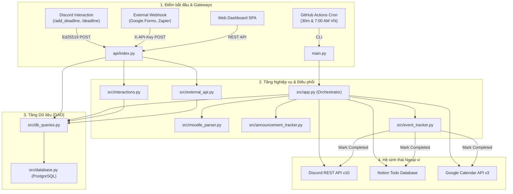

# REPOSITORY CONTEXT PACK (BẢN TỔNG HỢP TOÀN DIỆN)

> **Dự án:** Course FIT HCMUS Notification & Automation Platform (`course-fit-bot`)  
> **Người thực hiện:** Solution Architect  
> **Mục tiêu:** Cung cấp tài liệu ngữ cảnh kiến trúc chuẩn mực để nạp vào prompt cho Chuyên gia Prompt hoặc LLM Context Window.

---

## MỤC LỤC

1. [Cấu trúc thư mục cấp cao & Phân tầng kiến trúc](#1-cấu-trúc-thư-mục-cấp-cao--phân-tầng-kiến-trúc)
2. [Tech Stack & Môi trường Runtime](#2-tech-stack--môi-trường-runtime)
3. [Luồng dữ liệu tổng thể (End-to-End Data Flow)](#3-luồng-dữ-liệu-tổng-thể-end-to-end-data-flow)
4. [Bản đồ các Module trọng yếu (Core Modules Inventory)](#4-bản-đồ-các-module-trọng-yếu-core-modules-inventory)
5. [Cross-cutting Concerns & Điểm nóng kỹ thuật](#5-cross-cutting-concerns--điểm-nóng-kỹ-thuật)

---

## 1. Cấu trúc thư mục cấp cao & Phân tầng kiến trúc

### 1.1 Cây thư mục cấp cao (High-Level Directory Tree)
Độ sâu tối đa 3 cấp, đã loại trừ rác, cache và build artifacts (`node_modules`, `.git`, `venv`, `__pycache__`, `dist`, logs/locks):

```text
.
├── .github/
│   └── workflows/
│       └── notify.yml            # CI/CD & Scheduled Cron Jobs (GitHub Actions)
├── api/                          # Serverless Gateway & HTTP Endpoints (Vercel Functions)
│   ├── add_deadline.py           # Webhook nhận deadline từ hệ thống bên thứ 3 (X-API-Key)
│   ├── index.py                  # API Gateway tổng hợp: REST API Dashboard + Discord Router
│   └── interactions.py           # Discord Interaction Webhook endpoint (Slash Commands)
├── data/                         # Local Seed Data, Sample Datasets & Cache
│   ├── calendar.ics              # File mẫu iCalendar từ Moodle
│   ├── notion_template.csv       # File mẫu cấu trúc dữ liệu Notion Todo List
│   └── state.json                # Trạng thái cache cục bộ (legacy fallback)
├── docs/                         # Tài liệu đặc tả kỹ thuật, roadmap & hướng dẫn tích hợp
│   └── context-pack/             # Bộ tài liệu kiến trúc chuẩn hóa cho Prompt / AI
├── frontend/                     # Single Page Application Dashboard (React + Vite + TypeScript)
│   ├── src/
│   │   ├── api/                  # Tầng giao tiếp mạng Frontend (Fetch client wrappers)
│   │   ├── components/           # Reusable UI Components (Button, Modal, Toast, Badge, Layout)
│   │   ├── features/             # Feature views (Dashboard metrics, Deadlines, Courses, Settings)
│   │   ├── types/                # TypeScript Interfaces & Data contracts
│   │   ├── utils/                # Helper utilities (Date parser, Timezone converters)
│   │   ├── App.tsx               # Root App Component & Tab routing
│   │   └── main.tsx              # React DOM entrypoint
│   ├── index.html                # HTML entrypoint
│   ├── package.json              # Khai báo dependencies Frontend
│   └── vite.config.ts            # Cấu hình bundler Vite
├── migrations/                   # Database DDL & Schema Versioning (PostgreSQL)
│   ├── 001_create_database.sql   # Khởi tạo bảng courses, deadlines, announcements, modules,...
│   ├── 002_add_display_name.sql  # Bổ sung display_name cho courses
│   ├── 004_add_discord_category.sql # Bổ sung phân nhóm kênh theo học kỳ (Category ID)
│   └── 005_add_manual_deadline_support.sql # Bổ sung nguồn gốc (source, added_by) cho deadline
├── scripts/                      # Công cụ CLI bảo trì, DevOps & Quản trị hệ thống
│   ├── check_url.py              # Kiểm tra tính khả dụng của endpoint
│   ├── clean_bot_messages.py     # Dọn dẹp tin nhắn cũ của bot trên Discord
│   ├── discord_auto_channel.py   # Script quét và tạo channel tự động
│   ├── dump_moodle_data.py       # Xuất dữ liệu Moodle phục vụ debug
│   ├── notion_helper.py          # Script tiện ích kiểm tra & thiết lập bảng Notion
│   ├── register_commands.py      # Đăng ký Slash Commands với Discord REST API
│   ├── rename_all_channels.py    # Đồng bộ tên chuẩn hóa các kênh Discord
│   ├── run_server.py             # HTTP Server dev cục bộ cho API testing
│   └── set_category.py           # Gán học kỳ / Category thủ công cho môn học
├── src/                          # Backend Core Services & Infrastructure Adapters (Python)
│   ├── announcement_tracker.py   # Service giám sát tài liệu và diễn đàn Moodle
│   ├── app.py                    # Master Orchestrator (Pipeline xử lý cron, notify, nhắc hạn)
│   ├── config.py                 # Load biến môi trường & validate cấu hình
│   ├── database.py               # Quản lý kết nối PostgreSQL (Context Manager)
│   ├── db_queries.py             # Data Access Object (DAO) tập trung toàn bộ SQL Queries
│   ├── discord_api.py            # Client tương tác Discord REST API v10 (Rate-limit retry)
│   ├── event_tracker.py          # Listener theo dõi reaction Discord để tick hoàn thành
│   ├── external_api.py           # Logic xử lý API bên thứ 3 & HMAC auth
│   ├── google_calendar_sync.py   # Adapter đồng bộ Google Calendar API v3 (Service Account)
│   ├── interactions.py           # Xử lý Slash Commands & Xác thực chữ ký Ed25519
│   ├── moodle_api.py             # Client kết nối Moodle Web Services API
│   ├── moodle_parser.py          # Parser ICS, chuẩn hóa slug, trích xuất học kỳ
│   ├── notion_sync.py            # Adapter đồng bộ Notion Database API (Dynamic schema)
│   └── utils.py                  # Utilities chuẩn hóa thời gian và timezone UTC+7
├── tests/                        # Kiểm thử tự động (Unit & Integration tests)
├── main.py                       # CLI Execution Entrypoint cho GitHub Actions cron runner
├── pyproject.toml                # Cấu hình Python metadata & Vercel deployment
├── requirements.txt              # Khai báo dependencies Backend
└── vercel.json                   # Cấu hình build & routing serverless trên Vercel
```

### 1.2 Phân tầng kiến trúc (Architectural Layers)
1. **Ingestion / Gateway Layer (`api/`, `main.py`):** Tiếp nhận HTTP Request từ Vercel Serverless, Webhooks và CLI Trigger từ GitHub Actions.
2. **Presentation Layer (`frontend/src/`):** React 18 SPA quản trị Dashboard, Kanban, danh sách hạn nộp.
3. **Application / Orchestration Layer (`src/app.py`, `src/event_tracker.py`):** Điều phối luồng thông báo, đối soát phản hồi hoàn thành.
4. **Domain Services Layer (`src/announcement_tracker.py`, `src/moodle_parser.py`, `src/interactions.py`):** Quy tắc nghiệp vụ parse ICS, sinh slug, bóc tách học kỳ.
5. **Infrastructure & Adapters Layer (`src/discord_api.py`, `src/notion_sync.py`, `src/google_calendar_sync.py`, `src/moodle_api.py`):** Kết nối Discord REST API, Notion API, Google Calendar API và Moodle API.
6. **Data Access Layer (`src/database.py`, `src/db_queries.py`):** Context manager psycopg2 và tập trung toàn bộ raw SQL.

---

## 2. Tech Stack & Môi trường Runtime

* **Backend / Automation:**
  * **Python >= 3.10** (Thực thi trên GitHub Actions runner `ubuntu-latest` và Vercel Python Serverless Runtime).
  * `psycopg2-binary`: Driver PostgreSQL với `RealDictCursor`.
  * `requests`: Client HTTP gọi REST API bên ngoài.
  * `pynacl`: Xác thực mật mã Ed25519 cho Discord Webhook.
  * `google-auth (>= 2.0.0)` & `google-api-python-client (>= 2.0.0)`: Google Calendar API v3 Service Account SDK.
  * `python-dotenv`: Đọc cấu hình môi trường phát triển.
* **Frontend Web Dashboard:**
  * **React 18.3.1**, **TypeScript 5.7.3**, **Vite 6.1.0**.
  * **Tailwind CSS 3.4.17**, `clsx` (2.1.1), `tailwind-merge` (2.6.0), `lucide-react` (0.475.0).
* **Database & Hosting:**
  * **PostgreSQL (Supabase)**.
  * **Vercel:** Hosting Frontend SPA và Python Serverless Functions.
  * **GitHub Actions:** Bộ thực thi Cron định kỳ (`*/30 * * * *` và `0 0 * * *`).

---

## 3. Luồng dữ liệu tổng thể (End-to-End Data Flow)



---

## 4. Bản đồ các Module trọng yếu (Core Modules Inventory)

| Tên File | Trách nhiệm chính | LOC | Mức độ phức tạp |
| :--- | :--- | :---: | :---: |
| [`src/app.py`](file:///e:/coder/OnlyC%28ode%29/Notification%20Project/src/app.py) | Điều phối luồng xử lý toàn cục: quét deadline, gửi thông báo theo cấp bậc, nhắc hạn 3 ngày/1 ngày, tổng kết hàng ngày, đồng bộ kênh Discord, đồng bộ Notion & Google Calendar. | 629 | **Cao** |
| [`src/discord_api.py`](file:///e:/coder/OnlyC%28ode%29/Notification%20Project/src/discord_api.py) | Client Discord REST API v10: tạo/đổi tên kênh, phân nhóm Category, gửi tin nhắn, reaction, Scheduled Events, retry Rate Limit (429), quét và dọn tin lặp. | 478 | **Cao** |
| [`src/db_queries.py`](file:///e:/coder/OnlyC%28ode%29/Notification%20Project/src/db_queries.py) | DAO tập trung toàn bộ raw SQL cho `courses`, `deadlines`, `course_modules`, `forum_discussions`, dashboard stats. | 376 | **Trung bình** |
| [`src/announcement_tracker.py`](file:///e:/coder/OnlyC%28ode%29/Notification%20Project/src/announcement_tracker.py) | Crawler nội dung Moodle: quét cây tài liệu, phát hiện slide, bài tập mới và bài đăng diễn đàn mới. | 303 | **Trung bình** |
| [`src/google_calendar_sync.py`](file:///e:/coder/OnlyC%28ode%29/Notification%20Project/src/google_calendar_sync.py) | Adapter tích hợp Google Calendar API v3 qua Service Account: chống trùng, đặt 3 mốc push notification, đổi màu xanh lá khi xong. | 284 | **Trung bình** |
| [`src/notion_sync.py`](file:///e:/coder/OnlyC%28ode%29/Notification%20Project/src/notion_sync.py) | Adapter tích hợp Notion REST API: tự động nhận diện schema database Notion, tạo todo card và đồng bộ tick hoàn thành. | 250 | **Trung bình** |
| [`src/moodle_parser.py`](file:///e:/coder/OnlyC%28ode%29/Notification%20Project/src/moodle_parser.py) | Parse iCalendar ICS, bóc tách môn, tính học kỳ, bỏ dấu tiếng Việt, sinh slug kênh Discord chuẩn. | 245 | **Trung bình** |
| [`api/index.py`](file:///e:/coder/OnlyC%28ode%29/Notification%20Project/api/index.py) | API Gateway Vercel: xử lý CORS, phân luồng GET/POST cho Dashboard, Discord Webhook và Third-party API. | 194 | **Trung bình** |
| [`src/interactions.py`](file:///e:/coder/OnlyC%28ode%29/Notification%20Project/src/interactions.py) | Xử lý Discord Interactions: xác thực chữ ký Ed25519 (PyNaCl), thực thi lệnh `/add_deadline` và `/deadline`. | 105 | **Trung bình** |
| [`src/moodle_api.py`](file:///e:/coder/OnlyC%28ode%29/Notification%20Project/src/moodle_api.py) | Client gọi API Moodle Web Services: ngụy trang User-Agent vượt WAF trường, lấy user/khóa học/nội dung/diễn đàn. | 93 | **Thấp** |
| [`src/external_api.py`](file:///e:/coder/OnlyC%28ode%29/Notification%20Project/src/external_api.py) | Xử lý webhook thêm deadline bên thứ 3: xác thực HMAC constant-time, parse JSON an toàn. | 67 | **Thấp** |
| [`src/config.py`](file:///e:/coder/OnlyC%28ode%29/Notification%20Project/src/config.py) | Validate biến môi trường, thiết lập logger và múi giờ Việt Nam (UTC+7). | 59 | **Thấp** |
| [`src/database.py`](file:///e:/coder/OnlyC%28ode%29/Notification%20Project/src/database.py) | Quản lý kết nối PostgreSQL bằng context manager `get_db()`. | 53 | **Thấp** |
| [`src/event_tracker.py`](file:///e:/coder/OnlyC%28ode%29/Notification%20Project/src/event_tracker.py) | Đối soát reaction `✅` từ người dùng trên Discord để kích hoạt chuỗi hoàn thành nhiệm vụ. | 32 | **Thấp** |
| [`src/utils.py`](file:///e:/coder/OnlyC%28ode%29/Notification%20Project/src/utils.py) | Tiện ích phân tích ngày tháng `parse_due_time` và gán timezone UTC+7 `ensure_tz`. | 32 | **Thấp** |
| [`frontend/src/App.tsx`](file:///e:/coder/OnlyC%28ode%29/Notification%20Project/frontend/src/App.tsx) | Quản lý state toàn cục Dashboard, lọc môn học, điều hướng view. | 376 | **Trung bình** |

---

## 5. Cross-cutting Concerns & Điểm nóng kỹ thuật

### 5.1 Bảo mật & Xác thực
* **Discord Webhooks:** Xác thực chữ ký bất đối xứng **Ed25519** qua `pynacl.signing.VerifyKey`.
* **External Webhooks:** Xác thực khóa tĩnh qua `X-API-Key` với `hmac.compare_digest` chống Timing Attack.
* **Google Service Account:** Xác thực OAuth2 JWT qua Google Credentials.
* ⚠️ **Lỗ hổng cần lưu ý:** Các endpoint REST cho Web Dashboard trong `api/index.py` hiện tại mở hoàn toàn (`Access-Control-Allow-Origin: *`) và chưa có lớp xác thực người dùng.

### 5.2 Quản lý kết nối Database Serverless
* Dự án dùng `psycopg2` mở kết nối trực tiếp trong context manager `get_db()` và đóng ngay sau khi xử lý xong.
* **Điểm nóng:** Môi trường Serverless trên Vercel không có connection pool cục bộ, dễ gây cạn kiệt connection limit của Supabase. Khuyến nghị cấu hình `DATABASE_URL` dùng cổng Transaction Pooler `6543`.

### 5.3 Rà soát Nợ kỹ thuật
* **TODO / FIXME / HACK:** Không có bất kỳ thẻ nợ kỹ thuật nào trong code logic.
* **Lệnh `pass`:** Chỉ dùng an toàn khi bỏ qua import `python-dotenv` trên môi trường cloud.
* **Exception handling:** Cô lập lỗi ngoại vi an toàn (lỗi từ Google Calendar và Notion API chỉ log warning, không làm crash luồng bot chính).
