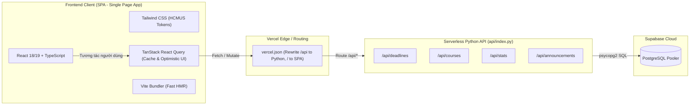

# QUY TRÌNH & LỘ TRÌNH TRIỂN KHAI FRONTEND (FRONTEND WORKFLOW & IMPLEMENTATION GUIDE)
## HỆ THỐNG: COURSE FIT HCMUS - STUDY & DEADLINE MANAGEMENT SYSTEM

> **Mục đích tài liệu:** Quy chuẩn hóa toàn bộ quy trình phát triển, cấu trúc thư mục, kiến trúc quản lý trạng thái và từng bước triển khai mã nguồn Frontend cho hệ thống Web Dashboard. Tài liệu này đóng vai trò là kim chỉ nam kỹ thuật (Technical Workflow) trước khi tiến hành viết code.

---

# MỤC LỤC
1. [Tổng quan Kiến trúc & Tech Stack](#1-tổng-quan-kiến-trúc--tech-stack)
2. [Cấu trúc Thư mục Chuẩn hóa (Feature-Driven Architecture)](#2-cấu-trúc-thư-mục-chuẩn-hóa)
3. [Quy chuẩn Định nghĩa Dữ liệu (Type Definitions)](#3-quy-chuẩn-định-nghĩa-dữ-liệu)
4. [Chiến lược Data Fetching & Optimistic Updates](#4-chiến-lược-data-fetching--optimistic-updates)
5. [Quy trình Triển khai 5 Giai đoạn (Step-by-Step Workflow)](#5-quy-trình-triển-khai-5-giai-đoạn)
   - [Giai đoạn 1: Khởi tạo Nền tảng & Cấu hình](#giai-đoạn-1-khởi-tạo-nền-tảng--cấu-hình)
   - [Giai đoạn 2: Xây dựng UI Primitives & Khung Layout](#giai-đoạn-2-xây-dựng-ui-primitives--khung-layout)
   - [Giai đoạn 3: Mở rộng Backend API Gateway](#giai-đoạn-3-mở-rộng-backend-api-gateway)
   - [Giai đoạn 4: Phát triển 5 Module Tính năng Chính](#giai-đoạn-4-phát-triển-5-module-tính-năng-chính)
   - [Giai đoạn 5: Kiểm thử, Tối ưu & Triển khai Vercel](#giai-đoạn-5-kiểm-thử-tối-ưu--triển-khai-vercel)
6. [Quy tắc Viết Code (Coding & Design Conventions)](#6-quy-tắc-viết-code)

---

# 1. TỔNG QUAN KIẾN TRÚC & TECH STACK



### Tiêu chí Kỹ thuật Cốt lõi:
- **Zero Cold-start:** Build ra 100% static assets (`HTML/CSS/JS`), được Vercel phục vụ qua Edge CDN toàn cầu với thời gian phản hồi `< 200ms`.
- **Độc lập và An toàn:** Frontend nằm trọn vẹn trong thư mục `frontend/`, không làm ảnh hưởng đến tiến trình chạy ngầm `main.py` của Bot Discord trên GitHub Actions.
- **Phản hồi tức thời (0ms Latency):** Thao tác tick hoàn thành `✅` bài tập cập nhật giao diện ngay lập tức trước khi server phản hồi (Optimistic Updates).

---

# 2. CẤU TRÚC THƯ MỤC CHUẨN HÓA

Toàn bộ mã nguồn giao diện được tổ chức theo kiến trúc **Feature-based Modular**:

```text
frontend/
├── public/                          # Tài nguyên tĩnh: Favicon, Logo FIT HCMUS
│   ├── favicon.ico
│   └── logo-fit.svg
├── src/
│   ├── assets/                      # Hình ảnh minh họa, icon rỗng (Empty state)
│   │
│   ├── api/                         # Lớp giao tiếp mạng (Networking Layer)
│   │   ├── client.ts                # Base fetch wrapper, xử lý URL & mã lỗi HTTP
│   │   └── endpoints.ts             # Danh sách hằng số Endpoint URL
│   │
│   ├── types/                       # Khai báo TypeScript Models (Ánh xạ 1:1 với Supabase)
│   │   ├── course.ts                # Interface Course
│   │   ├── deadline.ts              # Interface Deadline, DeadlineStatus, DeadlineFilter
│   │   ├── announcement.ts          # Interface Announcement, CourseModule
│   │   └── stats.ts                 # Interface DashboardStats
│   │
│   ├── components/                  # Thư viện UI nguyên tử tái sử dụng (Design System)
│   │   ├── ui/
│   │   │   ├── Button.tsx           # Button (Primary, Secondary, Ghost, Danger)
│   │   │   ├── Badge.tsx            # Status Badge (Gấp, Sắp tới, Đã xong, Quá hạn)
│   │   │   ├── Input.tsx            # Input trường văn bản, Search box có icon
│   │   │   ├── Dropdown.tsx         # Dropdown chọn môn, chọn học kỳ
│   │   │   ├── Modal.tsx            # Hộp thoại Modal Container (Overlay + Animate)
│   │   │   ├── ProgressBar.tsx      # Thanh tiến độ học kỳ (Gradient / Striped)
│   │   │   ├── Checkbox.tsx         # Checkbox tương tác hoàn thành bài tập
│   │   │   ├── Skeleton.tsx         # Hiệu ứng Shimmer khi đang tải dữ liệu
│   │   │   └── Toast.tsx            # Hộp thông báo nổi phản hồi kết quả
│   │   └── layout/
│   │       ├── Header.tsx           # Thanh điều hướng trên cùng (Search, Add CTA, Status)
│   │       ├── Sidebar.tsx          # Thanh menu bên trái (Thu gọn / Mở rộng)
│   │       └── PageContainer.tsx    # Khung layout chuẩn bọc nội dung các màn hình
│   │
│   ├── features/                    # 5 Module tính năng nghiệp vụ chính
│   │   │
│   │   ├── dashboard/               # [Màn 1] Dashboard Tổng quan
│   │   │   ├── components/
│   │   │   │   ├── HeroProgressBanner.tsx # Banner tiến độ học kỳ lớn
│   │   │   │   ├── MetricCards.tsx        # 4 thẻ KPI (Tổng, Gấp, Đã xong, Môn)
│   │   │   │   ├── UrgentDeadlines.tsx    # Danh sách việc cần nộp trong 24 giờ
│   │   │   │   └── QuickLinks.tsx         # Lối tắt mở Discord, GCal, Notion
│   │   │   └── useDashboardStats.ts       # Hook lấy số liệu thống kê từ /api/stats
│   │   │
│   │   ├── deadlines/               # [Màn 2] Trung tâm Quản lý Deadline
│   │   │   ├── components/
│   │   │   │   ├── DeadlineItemCard.tsx   # Card bài tập + Checkbox hoàn thành
│   │   │   │   ├── DeadlineToolbar.tsx    # Thanh tìm kiếm + Bộ lọc môn + View Switcher
│   │   │   │   ├── DeadlineListView.tsx   # Hiển thị dạng danh sách theo ngày/tuần
│   │   │   │   ├── DeadlineKanbanView.tsx # Hiển thị dạng bảng Kanban 3 cột
│   │   │   │   ├── DeadlineCalendarView.tsx# Hiển thị dạng lịch tháng
│   │   │   │   └── AddDeadlineModal.tsx   # Form modal thêm deadline nội bộ
│   │   │   ├── hooks/
│   │   │   │   ├── useDeadlines.ts        # Query fetching danh sách deadline
│   │   │   │   └── useToggleComplete.ts   # Mutation xử lý Optimistic Update ✅
│   │   │   └── deadlineUtils.ts           # Hàm tính countdown, format ngày Việt Nam
│   │   │
│   │   ├── courses/                 # [Màn 3] Môn học & Kho Tài liệu Moodle
│   │   │   ├── components/
│   │   │   │   ├── CourseCard.tsx         # Thẻ môn học (#nmttnt-csc10014)
│   │   │   │   ├── CourseMaterialList.tsx # Danh sách tài liệu (PDF, Slide, Link)
│   │   │   │   └── SemesterTabs.tsx       # Phân nhóm theo Category học kỳ
│   │   │   └── useCourses.ts              # Hook lấy danh sách môn từ /api/courses
│   │   │
│   │   ├── announcements/           # [Màn 4] Bảng tin & AI Tóm tắt (Gemini)
│   │   │   ├── components/
│   │   │   │   ├── AnnouncementCard.tsx   # Thẻ bài đăng diễn đàn Moodle
│   │   │   │   └── AISummaryBox.tsx       # Khung hiển thị tóm tắt TL;DR có gradient AI
│   │   │   └── useAnnouncements.ts        # Hook lấy thông báo từ /api/announcements
│   │   │
│   │   └── settings/                # [Màn 5] Cài đặt & Tích hợp Hệ thống
│   │       ├── components/
│   │       │   ├── IntegrationCard.tsx    # Thẻ thông tin trạng thái Discord/GCal/Notion
│   │       │   ├── ManualSyncButton.tsx   # Nút bấm cưỡng chế quét Moodle ngay
│   │       │   └── PasskeyConfig.tsx      # Quản lý mã truy cập quyền ghi
│   │       └── useSystemStatus.ts         # Hook kiểm tra tình trạng Bot & Database
│   │
│   ├── hooks/                       # Custom hooks toàn cục
│   │   ├── useTheme.ts              # Quản lý Dark/Light mode (lưu LocalStorage)
│   │   ├── useToast.ts              # Kích hoạt Toast notification
│   │   └── useDebounce.ts           # Trì hoãn thao tác gõ ô tìm kiếm
│   │
│   ├── utils/                       # Hàm tiện ích dùng chung
│   │   ├── dateUtils.ts             # Format ngày giờ GMT+7, tính thời gian đếm ngược
│   │   └── formatters.ts            # Định dạng tên môn, tiền tệ, số liệu
│   │
│   ├── App.tsx                      # Component gốc: Quản lý Tab Router & Providers
│   ├── main.tsx                     # Mount React vào index.html
│   └── index.css                    # Tailwind Directives & Custom Scrollbars
│
├── index.html                       # HTML Template
├── package.json                     # Danh sách thư viện phụ thuộc
├── tsconfig.json                    # Cấu hình TypeScript
├── tailwind.config.js               # Khai báo bảng màu tokens HCMUS Blue
└── vite.config.ts                   # Cấu hình Vite & Proxy API
```

---

# 3. QUY CHUẨN ĐỊNH NGHĨA DỮ LIỆU (TYPE DEFINITIONS)

Tất cả các Model trong Frontend phải khớp chuẩn với Schema Supabase của dự án:

```typescript
// src/types/course.ts
export interface Course {
  courses_id: number;
  course_name: string;        // Ví dụ: 'CSC10105'
  display_name: string;       // Ví dụ: 'Nhập môn tư duy thuật toán'
  lms_courses_id: string;     // ID trên Moodle (VD: '4210')
  chat_id: string | null;     // Discord Channel ID
  discord_category_id?: string | null;
  pending_deadlines_count?: number;
}

// src/types/deadline.ts
export type DeadlineSource = 'moodle' | 'manual' | 'external';

export interface Deadline {
  deadlines_id: number;
  courses_id: number;
  course_name: string;
  course_display_name?: string;
  deadline_name: string;
  due_time: string;           // Chuỗi ISO UTC
  due_time_vn: string;        // Định dạng đọc: "23:59 25/09/2026"
  source_url: string;
  source: DeadlineSource;
  added_by?: string | null;
  completed: boolean;
  completed_by?: string | null;
  is_urgent: boolean;         // < 24 giờ
  is_overdue: boolean;        // Quá hạn
  countdown_text: string;     // "Còn 5 giờ 30 phút"
  discord_channel_id?: string | null;
}

// src/types/stats.ts
export interface DashboardStats {
  total_deadlines: number;
  completed_deadlines: number;
  pending_deadlines: number;
  completion_rate: number;    // Tỷ lệ % (VD: 75.0)
  urgent_24h: number;         // Số bài cần nộp trong 24 giờ
  upcoming_3d: number;        // Số bài cần nộp trong 3 ngày
  overdue: number;
  total_courses: number;
}
```

---

# 4. CHIẾN LƯỢC DATA FETCHING & OPTIMISTIC UPDATES

Để người dùng có cảm giác ứng dụng phản hồi ngay lập tức (`0ms`), toàn bộ thao tác tick hoàn thành bài tập áp dụng cơ chế **Optimistic Update**:

```typescript
// src/features/deadlines/hooks/useToggleComplete.ts
import { useMutation, useQueryClient } from '@tanstack/react-query';
import { toggleDeadlineComplete } from '../../../api/client';
import { Deadline } from '../../../types/deadline';

export function useToggleComplete() {
  const queryClient = useQueryClient();

  return useMutation({
    mutationFn: ({ id, completed, userName }: { id: number; completed: boolean; userName?: string }) =>
      toggleDeadlineComplete(id, completed, userName),

    // 1. KHI NGƯỜI DÙNG VỪA BẤM NÚT:
    onMutate: async ({ id, completed, userName }) => {
      // Hủy mọi refetch đang diễn ra để tránh ghi đè
      await queryClient.cancelQueries({ queryKey: ['deadlines'] });

      // Lưu lại bản snapshot dữ liệu cũ để phòng ngừa lỗi rollback
      const previousDeadlines = queryClient.getQueryData<Deadline[]>(['deadlines']);

      // CẬP NHẬT GIAO DIỆN NGAY LẬP TỨC (0ms)
      queryClient.setQueryData<Deadline[]>(['deadlines'], (old) => {
        if (!old) return [];
        return old.map((d) =>
          d.deadlines_id === id
            ? { ...d, completed, completed_by: completed ? (userName || 'Bạn') : null }
            : d
        );
      });

      return { previousDeadlines };
    },

    // 2. NẾU CÓ LỖI XẢY RA (Mất mạng, Server lỗi):
    onError: (_err, _variables, context) => {
      // Khôi phục lại trạng thái cũ
      if (context?.previousDeadlines) {
        queryClient.setQueryData(['deadlines'], context.previousDeadlines);
      }
    },

    // 3. KHI XONG: Đồng bộ lại ngầm với Server
    onSettled: () => {
      queryClient.invalidateQueries({ queryKey: ['deadlines'] });
      queryClient.invalidateQueries({ queryKey: ['stats'] });
    },
  });
}
```

---

# 5. QUY TRÌNH TRIỂN KHAI 5 GIAI ĐOẠN (STEP-BY-STEP WORKFLOW)

---

### Giai đoạn 1: Khởi tạo Nền tảng & Cấu hình (Foundation)
1. **Khởi tạo thư mục `frontend/`:**
   - Chạy lệnh khởi tạo Vite template `react-ts`.
   - Cài đặt các thư viện bắt buộc:
     ```bash
     npm install @tanstack/react-query lucide-react clsx tailwind-merge
     npm install -D tailwindcss postcss autoprefixer
     ```
2. **Cấu hình Tailwind CSS & Design Tokens:**
   - Khởi tạo `tailwind.config.js` với các mã màu thương hiệu HCMUS Blue (`#2563EB`, `#0D2552`), màu Trạng thái và phông chữ `Plus Jakarta Sans`.
   - Thiết lập CSS Variables hỗ trợ chuyển đổi Dark / Light mode mượt mà.
3. **Cấu hình Vite Dev Proxy (`vite.config.ts`):**
   - Thiết lập cổng chạy Local `5173`.
   - Định tuyến toàn bộ request bắt đầu bằng `/api` sang cổng backend `http://localhost:8000`.
4. **Cấu hình Triển khai Vercel (`vercel.json`):**
   - Thêm lệnh build frontend: `"buildCommand": "cd frontend && npm install && npm run build"`.
   - Đặt thư mục phân phối tĩnh: `"outputDirectory": "frontend/dist"`.
   - Giữ nguyên cấu hình Serverless Python Functions tại `/api/(.*)`.

---

### Giai đoạn 2: Xây dựng UI Primitives & Khung Layout (Design System)
1. **Xây dựng các Component dùng chung (`src/components/ui/`):**
   - `Button.tsx`: Hỗ trợ 5 biến thể (Primary, Secondary, Outline, Ghost, Danger) và trạng thái loading spinner.
   - `Badge.tsx`: Hiển thị độ khẩn cấp bài tập (Khẩn cấp, Sắp tới, Đã nộp, Quá hạn).
   - `Checkbox.tsx`: Thiết kế riêng với hiệu ứng tick xanh lá mượt mà.
   - `ProgressBar.tsx`: Thanh tiến độ học kỳ có hỗ trợ dải màu gradient.
   - `Modal.tsx`: Hộp thoại mở ra dạng Overlay mờ nền (`backdrop-blur`).
   - `Toast.tsx`: Thông báo nổi góc phải dưới màn hình.
2. **Xây dựng Shell Layout (`src/components/layout/`):**
   - `Header.tsx`: Thanh điều hướng chứa Logo, Ô tìm kiếm nhanh (Cmd+K), Nút "+ Thêm Deadline", Đèn báo trạng thái Serverless (`🟢 Live Sync`), Nút đổi theme.
   - `Sidebar.tsx`: Danh mục chuyển đổi giữa 5 màn hình chính, hỗ trợ thu gọn tiết kiệm không gian.
   - `PageContainer.tsx`: Đảm bảo độ rộng khung hình chuẩn `1440px` và đệm lề chuẩn Responsive.

---

### Giai đoạn 3: Mở rộng Backend API Gateway (`api/index.py` & `src/`)
1. **Cập nhật `src/db_queries.py`:**
   - Viết hàm `toggle_deadline_completed(conn, deadlines_id, completed, completed_by)`.
   - Viết hàm `get_dashboard_stats(conn)` tính toán tỷ lệ % hoàn thành và số bài khẩn cấp.
   - Viết hàm `get_all_deadlines_formatted(conn, course_name, status)`.
2. **Cập nhật routing tại `api/index.py`:**
   - Bổ sung handler `GET /api/courses` trả về danh sách môn kèm số deadline chờ.
   - Bổ sung handler `GET /api/deadlines` hỗ trợ lọc theo môn và trạng thái.
   - Bổ sung handler `POST /api/deadlines` tạo deadline thủ công từ Web UI.
   - Bổ sung handler `POST /api/deadlines/toggle` đánh dấu hoàn thành bài tập.
   - Bổ sung handler `GET /api/stats` cung cấp số liệu tổng quan.
   - Bổ sung CORS Headers cho phép truy cập an toàn từ môi trường dev `localhost:5173`.

---

### Giai đoạn 4: Phát triển 5 Module Tính năng Chính
1. **Module 1: Dashboard Tổng quan (`features/dashboard/`):**
   - Banner tiến độ học kỳ hiển thị lời chào cá nhân hóa và thanh Progress Bar lớn.
   - 4 Thẻ KPI: Tổng số deadline, Cần nộp gấp (<24h), Đã hoàn thành, Môn đang theo dõi.
   - Khối danh sách bài tập khẩn cấp hiển thị trên cùng cột trái.
   - Khối Lịch thi & Phím tắt nhanh Discord/Google Calendar/Notion ở cột phải.
2. **Module 2: Quản lý Deadline (`features/deadlines/`):**
   - Bộ lọc Toolbar: Tìm kiếm từ khóa, Dropdown lọc môn, Filter chips theo trạng thái.
   - 3 Chế độ hiển thị:
     - **List View:** Phân cụm bài tập theo Hôm nay / Tuần này / Đã xong.
     - **Kanban Board:** 3 Cột (To-Do, Urgent, Done) hỗ trợ trực quan hóa tiến độ.
     - **Calendar View:** Lịch tháng đánh dấu hạn nộp bài.
   - Tích hợp Modal `AddDeadlineModal`: Form thêm deadline nội bộ với các nút tắt "Hôm nay 23:59", "Tối mai 23:59".
3. **Module 3: Môn học & Kho Tài liệu (`features/courses/`):**
   - Danh sách thẻ môn học grouped theo học kỳ (HK1 2024-2025).
   - Hiển thị mã kênh Discord (`#nmttnt-csc10014`) kèm nút nhảy nhanh sang Discord.
   - Kho tài liệu Moodle: Danh sách PDF slide bài giảng, file nén Lab đã sync từ Moodle API.
4. **Module 4: Bảng tin Thông báo & AI Tóm tắt (`features/announcements/`):**
   - Luồng tin diễn đàn Moodle từ giảng viên.
   - Hộp tóm tắt **AI TL;DR (Gemini)** làm nổi bật 2-3 ý chính (Dời lịch học, gia hạn nộp bài).
5. **Module 5: Cài đặt Hệ thống & Tích hợp (`features/settings/`):**
   - Bảng điều khiển kiểm tra kết nối: Discord Bot, Google Calendar, Notion, Supabase.
   - Nút hành động: "🔄 Ép quét Moodle ngay lập tức" và xem log đồng bộ.

---

### Giai đoạn 5: Kiểm thử, Tối ưu & Triển khai Vercel (Production Readiness)
1. **Kiểm tra tĩnh & Đóng gói:**
   - Chạy `npm run build` trong `frontend/` đảm bảo 100% không có lỗi TypeScript (`tsc --noEmit`).
   - Kiểm tra kích thước bundle: Đảm bảo tổng dung lượng gzipped `< 200 KB`.
2. **Kiểm thử End-to-End cục bộ (Local E2E Testing):**
   - Chạy script `python scripts/run_server.py` kết hợp mở web dashboard.
   - Kiểm tra hiển thị đủ 18 môn học từ cơ sở dữ liệu Supabase thực tế.
   - Thử thêm 1 deadline nội bộ qua Form -> Kiểm tra DB đã lưu thành công.
   - Thử tick hoàn thành bài tập -> Kiểm tra trạng thái DB và hiệu ứng Toast.
3. **Triển khai lên Vercel:**
   - Push commit lên nhánh `main` trên GitHub.
   - Vercel tự động build Frontend và deploy Serverless API song song.
   - Kiểm tra link production trên cả máy tính và trình duyệt điện thoại.

---

# 6. QUY TẮC VIẾT CODE (CODING CONVENTIONS)

1. **Nguyên tắc Đặt tên File & Thư mục:**
   - Component React: Đặt theo `PascalCase` (ví dụ: `DeadlineItemCard.tsx`, `HeroProgressBanner.tsx`).
   - Hook, Utils, Types: Đặt theo `camelCase` (ví dụ: `useDeadlines.ts`, `dateUtils.ts`).
2. **Không dùng Dữ liệu Giả (No Dummy/Lorem Ipsum Data):**
   - Toàn bộ văn bản mẫu phải dùng ngữ cảnh thực tế của sinh viên Khoa CNTT - HCMUS (Mã môn: `CSC10014`, `CSC10105`, Tên: `Kỹ thuật lập trình`, Giảng viên, hạn chót giờ Việt Nam).
3. **Xử lý Thời gian Chuẩn mực:**
   - Mọi thời điểm lưu trong Database và truyền qua API bắt buộc là **UTC ISO 8601** (`2026-09-25T16:59:00Z`).
   - Mọi hiển thị giao diện cho người dùng phải chuyển đổi sang **Múi giờ Việt Nam GMT+7** (`23:59 25/09/2026`).
4. **Xử lý Responsive:**
   - Thiết kế Mobile-first hoặc Desktop-first có breakpoint rõ ràng (`sm: 640px`, `md: 768px`, `lg: 1024px`, `xl: 1280px`).
   - Trên màn hình nhỏ (`< 768px`): Tự động ẩn Sidebar, chuyển thành Menu Drawer, các bảng chuyển thành thẻ Card xếp dọc.

---
*Tài liệu này là quy chuẩn kỹ thuật chính thức cho phân hệ Frontend của dự án Course FIT HCMUS. Mọi lập trình viên hoặc AI Agent khi tham gia phát triển đều phải tuân thủ đúng cấu trúc và lộ trình này.*
